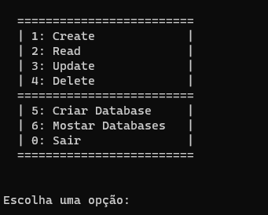

# Crud Python

### Crud Basico feito em Python

### Modulos usados 
mysql.connector 
termcolor

### Banco de dados 
database - programacao 
tabela - linguagens

colunas = id, nome, criacao

Output 

